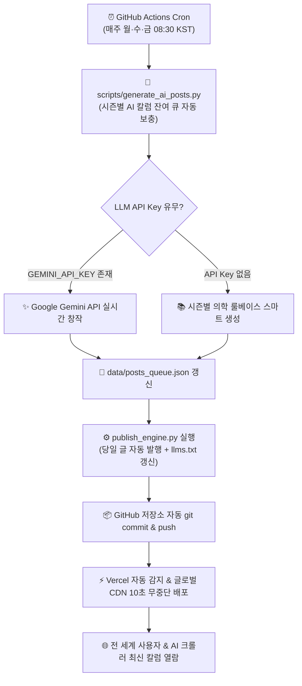

# 🚀 검단중앙내과의원 건강블로그: GitHub + Vercel 무중단 자동 배포 및 AI 원고 생성 가이드

본 문서는 **검단중앙내과의원(Geomdan Joongang Clinic)** 공식 독립 건강블로그를 **GitHub**과 **Vercel**에 배포하고, **주 3회(월·수·금 오전 08:30 KST) 무중단 자동 발행 및 시즌별 AI 원고 생성 시스템**을 운영하기 위한 종합 매뉴얼입니다.

---

## 💡 "새글 쓰는데 LLM API가 꼭 필요한가요?"

> **결론: 100% 자율적인 신규 원고 창작에는 LLM API가 필요하지만, 본 시스템은 API 키가 없어도 100% 안전하게 동작하도록 '이중 하이브리드 엔진'으로 설계되었습니다.**

### 1. LLM API Key가 연결된 경우 (완전 자율 생성 모드)
- GitHub Repository Secrets에 **`GEMINI_API_KEY`** 또는 **`OPENAI_API_KEY`**를 등록해 두면:
  - 매주/매월 큐가 소진될 때마다 AI가 실시간으로 시즌(독감, 연말검진, 환절기 등)과 환자들의 고민을 반영하여 **세상에 없던 100% 새로운 칼럼과 텍스트 그래픽 카피를 자동 창작**합니다.
  - **추천: Google Gemini API (무료 티어 활용)**
    - Gemini 1.5 Flash / 2.0 Flash는 무료 사용량(Free Tier)이 매우 넉넉하여, 병원 블로그 수준(주 3회, 월 12회)의 요청은 **비용이 0원(완전 무료)**으로 평생 운영이 가능합니다.
  - **차선: OpenAI API (`gpt-4o-mini`)**
    - 월 12편 기준 약 100~200원 수준으로 매우 안정적입니다.

### 2. LLM API Key가 없는 경우 (스마트 시즌 템플릿 Fallback 모드)
- API 키를 발급받지 않았거나 등록하지 않아도 걱정하실 필요가 없습니다.
- 본 시스템의 `scripts/generate_ai_posts.py`에는 **봄(3~5월) / 여름(6~8월) / 가을(9~11월) / 겨울(12~2월)** 4계절 12개월의 계절별 의학 지식베이스가 내장되어 있어, API 키 없이도 시즌에 꼭 맞는 전문 칼럼을 자동으로 조합하여 큐를 끊김 없이 채워줍니다.
- 언제든 나중에 API 키를 등록하면 즉시 LLM 실시간 생성 모드로 자동 전환됩니다.

---

## 🏗️ 전체 자동 운영 아키텍처 (Workflow)



---

## 🛠️ 실전 배포 3단계 (Step-by-Step)

### 1단계: GitHub 저장소 생성 및 코드 푸시

1. [GitHub](https://github.com)에 로그인 후 새로운 저장소(New Repository)를 생성합니다. (예: `geomdan-joongang-blog`, 공개 또는 비공개 자유)
2. 로컬 터미널(PowerShell)에서 프로젝트 폴더로 이동 후 아래 명령어를 순서대로 실행합니다:

```powershell
cd c:\note\gumdancenter

# Git 초기화 및 메인 브랜치 설정
git init -b main

# 전체 파일 스테이징 및 커밋
git add .
git commit -m "feat: Initial commit for Geomdan Joongang Clinic GEO Blog"

# 본인의 GitHub 원격 저장소 주소 연결
git remote add origin https://github.com/<본인의GitHub아이디>/<저장소이름>.git

# 원격 저장소로 푸시
git push -u origin main
```

---

### 2단계: Vercel 원클릭 연동 배포

1. [Vercel](https://vercel.com)에 접속하여 GitHub 계정으로 로그인합니다.
2. 대시보드 우측 상단의 **[Add New...]** -> **[Project]**를 클릭합니다.
3. 방금 푸시한 GitHub 저장소를 찾아 **[Import]** 버튼을 누릅니다.
4. 설정 화면:
   - **Framework Preset**: `Other`
   - **Root Directory**: `./` (기본값 유지)
   - **Build & Development Settings**: 그대로 둠
5. **[Deploy]** 버튼을 클릭합니다.
   - 약 20~30초 후 배포가 완료되며 고유 주소(`https://<프로젝트명>.vercel.app`)가 즉시 발급됩니다.
   - 추후 병원 공식 도메인(예: `blog.joongangmedicine.com`)도 Vercel Settings -> Domains에서 쉽게 연결할 수 있습니다.

---

### 3단계: GitHub Actions 권한 및 LLM API Key 등록

자동 포스팅 봇이 매주 월·수·금 08:30에 새 글을 커밋할 수 있도록 권한을 설정합니다.

#### 1) GitHub Actions 쓰기 권한 활성화 (필수)
1. GitHub 저장소의 **[Settings]** -> 좌측 메뉴의 **[Actions]** -> **[General]** 클릭
2. 페이지 하단의 **Workflow permissions** 섹션으로 이동
3. **[Read and write permissions]**를 선택하고 **Save** 클릭

#### 2) LLM API Key 등록 (선택 사항: Gemini 무료 API 권장)
1. GitHub 저장소의 **[Settings]** -> **[Secrets and variables]** -> **[Actions]** 클릭
2. **[New repository secret]** 버튼 클릭
3. 이름과 값 입력:
   - **Name**: `GEMINI_API_KEY` (또는 `OPENAI_API_KEY`)
   - **Secret**: 발급받은 API 키 입력
   - **Add secret** 클릭
4. *참고: API 키를 등록하지 않아도 내장된 룰베이스 엔진으로 100% 정상 작동합니다.*

---

## 📅 시즌별 로테이션 발행 스케줄 안내

검단중앙내과의 3대 핵심 경쟁력을 균형 있게 노출하기 위해 다음의 요일별 로테이션이 유지됩니다:

| 요일 | 발행 시각 | 전문 분류 | 담당 의료진 | 핵심 메시지 |
| :--- | :--- | :--- | :--- | :--- |
| **매주 월요일** | 08:30 KST | **위·대장 내시경** | **노인영 대표원장**<br>(소화기내시경 세부전문의) | 대학병원급 고화질 내시경, 당일 원스톱 용종절제술, 안전 수면내시경 |
| **매주 수요일** | 08:30 KST | **5대암 국가건강검진** | **노인영 대표원장**<br>(내과 전문의) | 보건복지부 지정 5대암 검진, 200평 독립 종합검진센터, 간·복부 초음파 |
| **매주 금요일** | 08:30 KST | **일요일진료 / 수액** | **김인선 원장**<br>(가정의학과 전문의) | 일요일 아침 8시 반 정상 진료, 2인 전문의 협진, 만성질환, 독감, 맞춤 수액 |

---

## 🔍 수동 테스트 및 강제 실행 방법

- **GitHub 웹에서 즉시 발행 테스트하기**:
  - GitHub 저장소의 **[Actions]** 탭 -> **[Auto Publish Medical Column...]** 선택 -> 우측 **[Run workflow]** 클릭 시 즉시 스크립트가 실행되어 배포 상태를 검증할 수 있습니다.
- **로컬에서 테스트하기**:
  - `python scripts/generate_ai_posts.py` (시즌별 신규 칼럼 큐 확장)
  - `python publish_engine.py` (현재 시간 기준 발행 처리 및 `llms.txt` 동기화)
